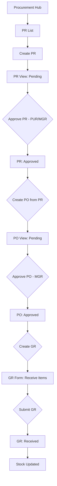
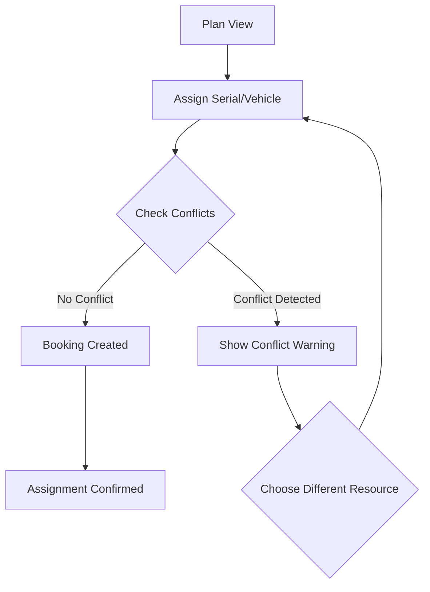
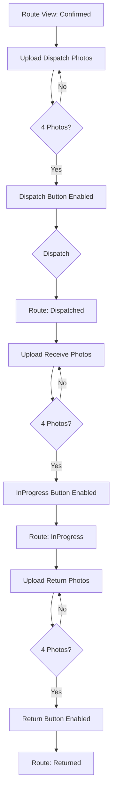
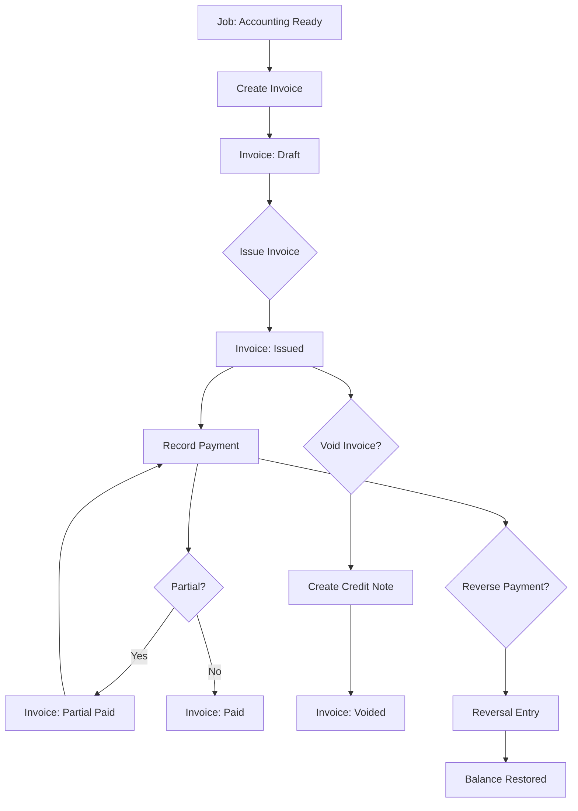
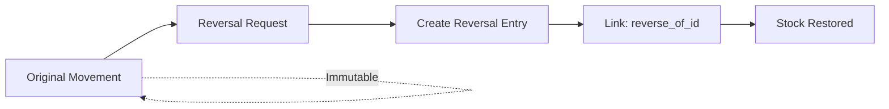
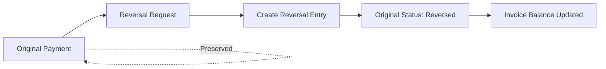

# UI Flow Map - 4ERP v2

**Generated**: 2026-01-18  
**Branch**: phase5-v2

## Overview

This document maps the key user journeys through the ERP system per `agents.md` requirements.

---

## 1. Job Lifecycle Flow (Happy Path)

```mermaid
flowchart TD
    A[Dashboard] --> B[Jobs List]
    B --> C[Create Job]
    C --> D[Job View: Draft]
    D --> E{Submit}
    E --> F[Job: Submitted]
    F --> G{Approve - MGR}
    G --> H[Job: Approved]
    H --> I[Planning View]
    I --> J{Create Plan}
    J --> K[Plan View]
    K --> L{Assign Resources}
    L --> M[Job: Planned]
    M --> N[Create Route]
    N --> O[Route View]
    O --> P{Upload 4 Photos}
    P --> Q{Dispatch}
    Q --> R[Route: Dispatched]
    R --> S{Work Complete}
    S --> T{Upload Return Photos}
    T --> U{Mark Returned}
    U --> V[Route: Returned]
    V --> W{WH Receive}
    W --> X[Route: WHReceived]
    X --> Y[Job: Accounting Ready]
```



---

## 2. Procurement Flow (PR → PO → GR)



---

## 3. Conflict Detection Flow



---

## 4. Evidence Photo Flow



---

## 5. Accounting AR Flow



---

## 6. Reversal Patterns

### Stock Movement Reversal


### Payment Reversal


---

## 7. RBAC Visibility Matrix

| Screen | ADM | SAL | PLN | PUR | HR | WH | ACC | MGR |
|--------|-----|-----|-----|-----|----|----|-----|-----|
| Dashboard | ✅ | ✅ | ✅ | ✅ | ✅ | ✅ | ✅ | ✅ |
| Jobs | ✅ | ✅ | ✅ | ❌ | ❌ | ❌ | ❌ | ✅ |
| Planning | ✅ | ❌ | ✅ | ❌ | ❌ | ❌ | ❌ | ✅ |
| Routes | ✅ | ❌ | ✅ | ❌ | ❌ | ✅ | ❌ | ❌ |
| PR Create | ✅ | ✅ | ✅ | ✅ | ❌ | ✅ | ✅ | ❌ |
| PR Approve | ✅ | ❌ | ❌ | ✅ | ❌ | ❌ | ❌ | ✅ |
| PO Create | ✅ | ❌ | ❌ | ✅ | ❌ | ❌ | ❌ | ❌ |
| PO Approve | ✅ | ❌ | ❌ | ❌ | ❌ | ❌ | ❌ | ✅ |
| GR Create | ✅ | ❌ | ❌ | ❌ | ❌ | ✅ | ❌ | ❌ |
| Invoice Issue | ✅ | ❌ | ❌ | ❌ | ❌ | ❌ | ✅ | ❌ |
| Payment Record | ✅ | ❌ | ❌ | ❌ | ❌ | ❌ | ✅ | ❌ |
| WH Receive | ✅ | ❌ | ❌ | ❌ | ❌ | ✅ | ❌ | ❌ |
| Manpower Reg | ✅ | ❌ | ❌ | ❌ | ✅ | ❌ | ❌ | ❌ |
| Admin | ✅ | ❌ | ❌ | ❌ | ❌ | ❌ | ❌ | ✅ |
| Audit Logs | ✅ | ❌ | ❌ | ❌ | ❌ | ❌ | ❌ | ✅ |

---

## 8. Key Alternative Paths

### 8.1 Job Extend
```
Job: Approved → Extend Request → Job: Extended
```

### 8.2 Job Void
```
Job: Any Status (before Dispatched) → Void by MGR → Job: Voided
```

### 8.3 Route Cancel
```
Route: Confirmed/Dispatched → Cancel by MGR → Route: Cancelled → Bookings Released
```

### 8.4 Invoice Credit Note (Void)
```
Invoice: Issued → Void Request → Credit Note Created → Invoice: Voided
```

---

## 9. UI Gaps vs agents.md

| agents.md Requirement | UI Status | Gap |
|-----------------------|-----------|-----|
| M4 Warehouse Receive | ❌ No UI | Need screen for WH staff |
| M4 Stock Movements | ❌ No UI | Need movements list/view |
| M5 Invoice Management | ❌ No UI | Need invoice CRUD pages |
| M5 Payment Management | ❌ No UI | Need payment record page |
| M6 Policy Viewer | ❌ No UI | Nice-to-have for admin |
| 4-Photo Enforcement | ✅ In Route | Photos via Route view |
| Conflict Guard | ✅ In Planning | Visual feedback on conflicts |
| Audit Trail | ✅ Admin Logs | Full audit viewer exists |
