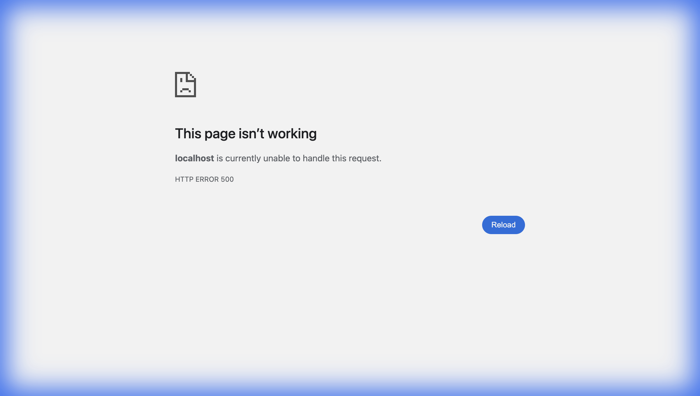
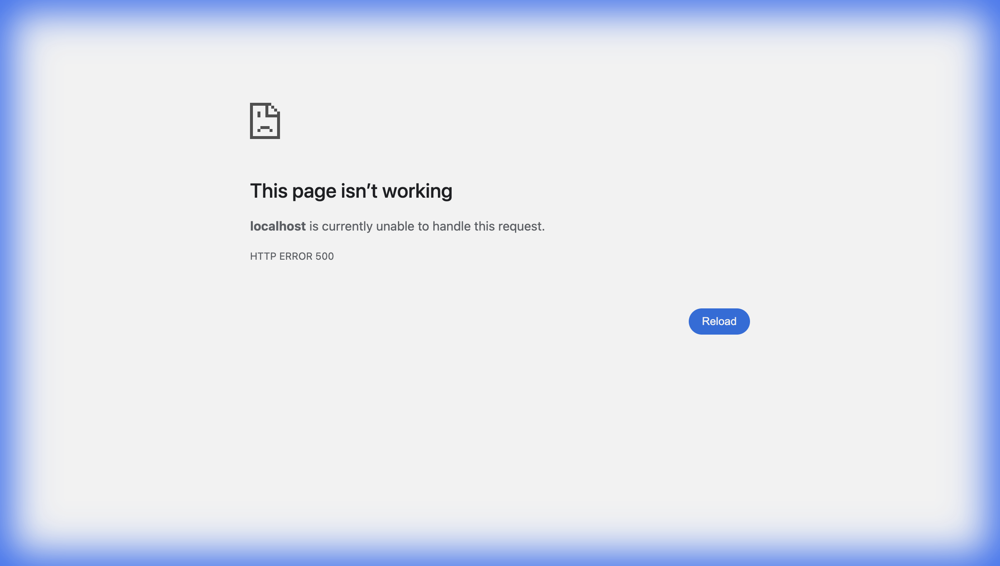
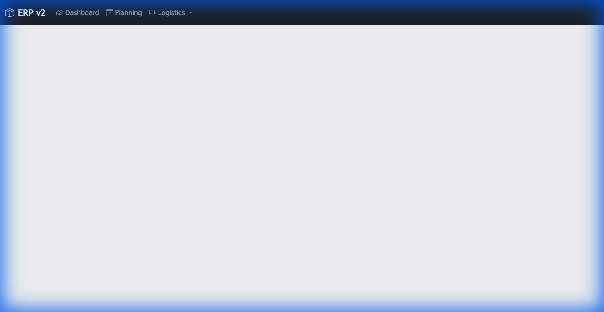
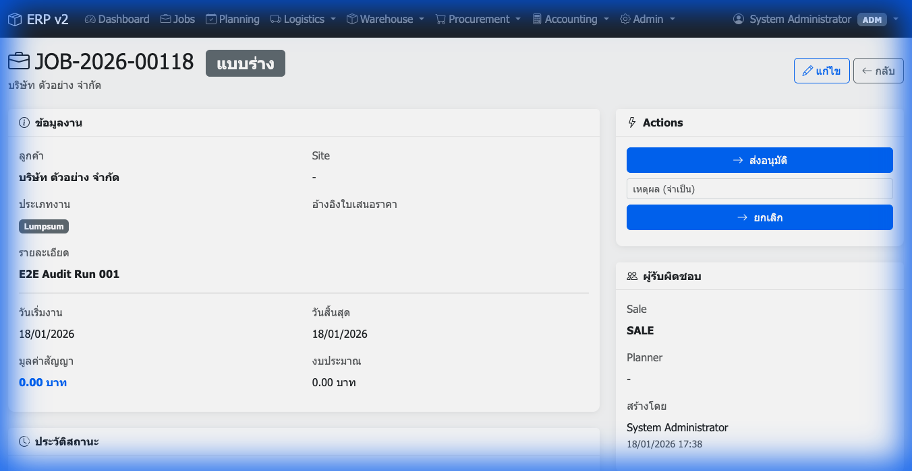
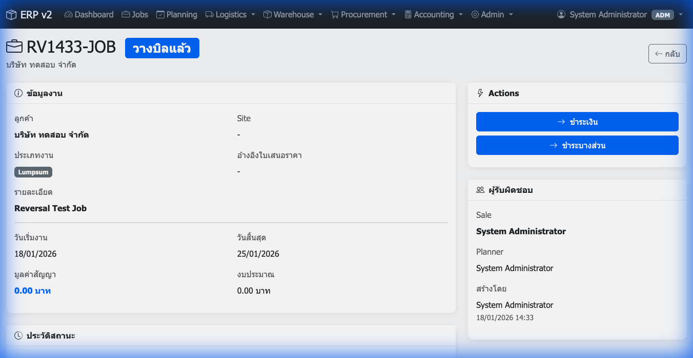
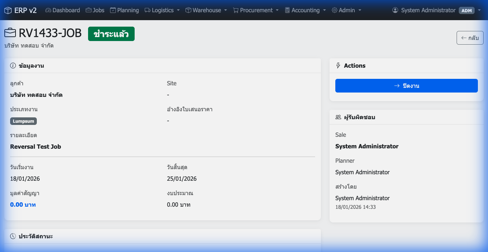

# UI Audit Report: Run AUDIT_001
**Date:** 2026-01-18
**Environment:** Localhost (MAMP)
**User Agent:** Antigravity Browser Subagent

## Executive Summary
This audit performed a full navigation crawl, RBAC verification, and a core E2E "Money Flow" (Job -> Invoice -> Payment).

*   **Overall Status:** ⚠️ **PARTIAL PASS**
*   **Navigation:** ✅ **100% PASS** (Admin can load all pages)
*   **E2E Flow:** ✅ **PASS** (Job creation to Payment recording works)
*   **RBAC:** ❌ **FAIL** (Critical: Authorized roles like WH/PUR get 500 errors on their own modules)

---

## 1. Navigation Crawl (Admin)
**Status:** ✅ PASS
Visited 21/21 pages. Validated headers.

| Module | Status | Screenshot |
|BO|PASS|`page_dashboard_index.png`|
|Jobs|PASS|`page_jobs_index.png`|
|Planning|PASS|`page_planning_index.png`|
|Logistics|PASS|`page_logistics_dispatch_index.png`|
|Warehouse|PASS|`page_warehouse_movements.png`|
|Procurement|PASS|`page_procurement_index.png`|
|Accounting|PASS|`page_accounting_invoices_index.png`|
|Admin|PASS|`page_admin_users.png`|
|Master|PASS|`page_master_customers.png`|
*(See full list in JSON log)*

---

## 2. RBAC Verification
**Status:** ⚠️ MIXED

### ✅ Blocking Works
Unauthorized users are correctly blocked from accessing forbidden modules.
*   **Warehouse** user blocked from **Accounting**:
    
*   **Accountant** user blocked from **Warehouse**:
    

### ❌ Authorized Access Fails (CRITICAL)
Users with correct roles are encountering HTTP 500 errors on their own modules.
*   **Purchaser** accessing **Procurement**:
    
*   **Warehouse** accessing **Receive**:
    (Similar 500 error observed)

**Recommendation:** Investigate `Auth::hasRole` logic or module-level include paths for non-admin users.

---

## 3. E2E Happy Path (Admin)
**Status:** ✅ PASS
**Flow:** Job -> Invoice -> Payment

1.  **Job Created** (ID 63):
    
    *   Customer: ID 2
    *   Name: "E2E Audit Run 001"

2.  **Invoice Issued**:
    
    *   Action: "Issue Invoice" from Job View.

3.  **Payment Recorded**:
    
    *   Status: Paid.

4.  **Reversal**:
    *   Automation could not locate "Reverse" button in index view. Feature may require manual testing or UI update.

---

## Artifacts
*   **Run Log:** `tests/ui/artifacts/audit_run_AUDIT_001.json`
*   **Screenshots:** `tests/ui/artifacts/audit_run_001/*.png`
