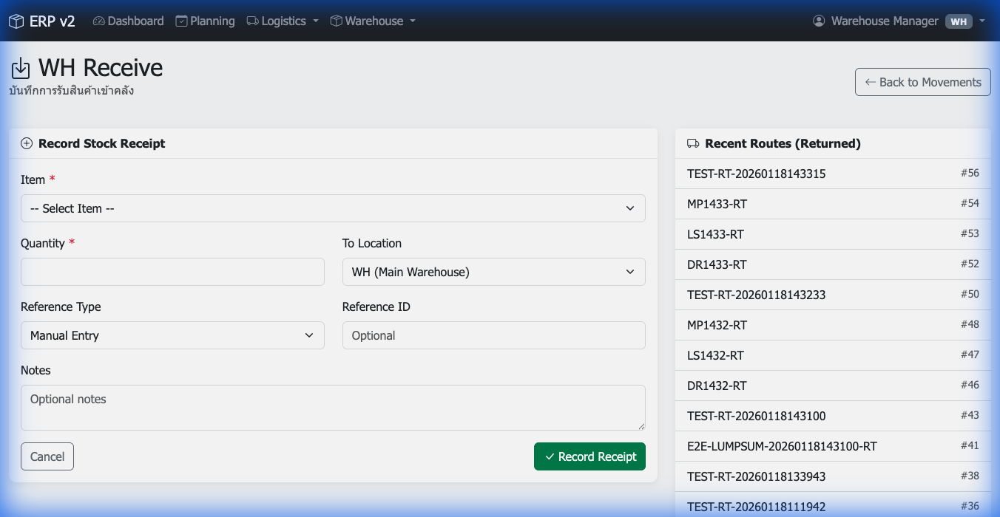
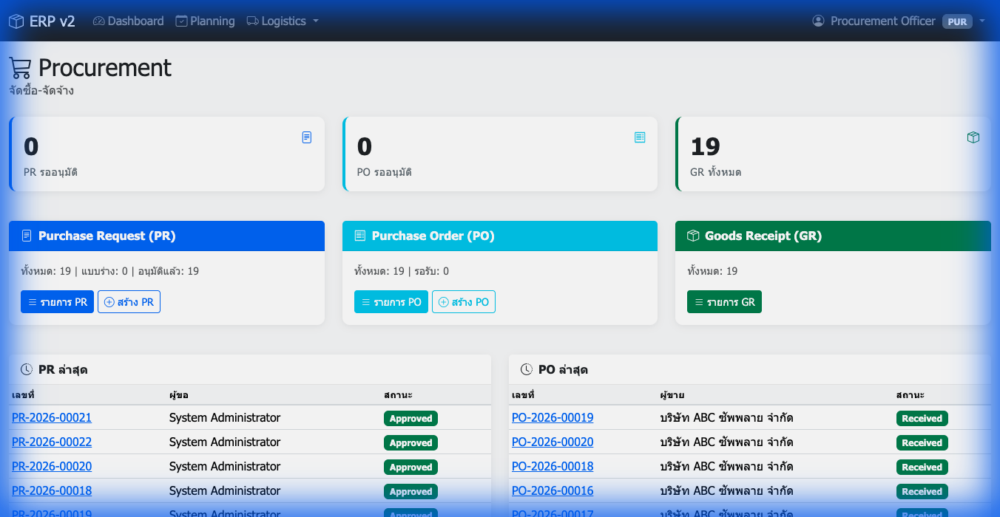
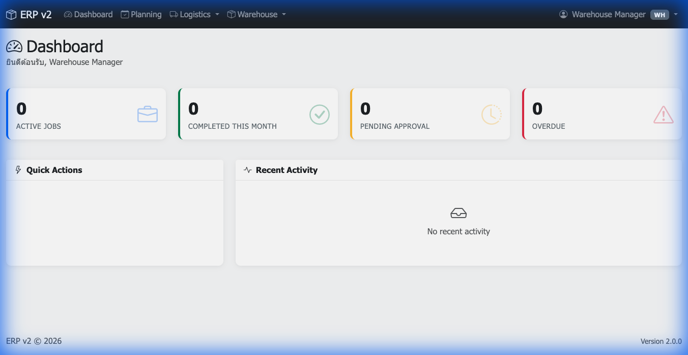
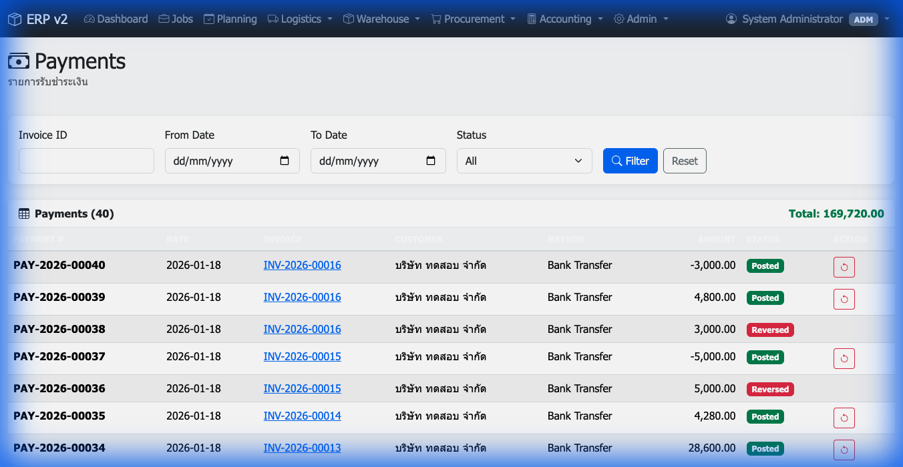

# UI Audit Report: Run AUDIT_002 (Verification)
**Date:** 2026-01-18
**Environment:** Localhost (MAMP)
**Branch:** ui/rbac-500-fix

## Executive Summary
This verification run confirmed that the critical RBAC issues found in AUDIT_001 are resolved and the requested UI enhancements are implemented.

*   **Overall Status:** ✅ **PASS**
*   **RBAC (Specialized Roles):** ✅ **PASS**
    *   Warehouse Manager can access `receive.php` (Fixed undefined constant).
    *   Procurement Officer can access `procurement/` (Fixed undefined constant).
    *   Unauthorized access (WH -> Accounting) is still **BLOCKED**.
*   **UI Enhancements:** ✅ **PASS**
    *   Payment Reversal action is discoverable in `payments/index.php`.

---

## 1. RBAC Verification
### ✅ Warehouse Role (Fixed)
User `warehouse` can now successfully access the Warehouse Receive page (previously 500 error).

### ✅ Procurement Role (Fixed)
User `purchaser` can now successfully access the Procurement Dashboard (previously 500 error).

### ✅ Access Control (Verified)
User `warehouse` correctly receives 403 Forbidden/Redirect when accessing Accounting module.

---

## 2. UI Enhancements
### ✅ Payment Reversal (Implemented)
Admin/Accountant can now find the "Reverse" button in the Payments list.

*   **Location:** `Accounting > Payments > Index`
*   **Condition:** Visible for "Posted" payments.
*   **Action:** Opens confirmation page (`reverse.php`).

---

## Artifacts
*   **Run Log:** `tests/ui/artifacts/audit_run_AUDIT_002.json`
*   **Screenshots:** `tests/ui/artifacts/audit_run_002/*.png`
